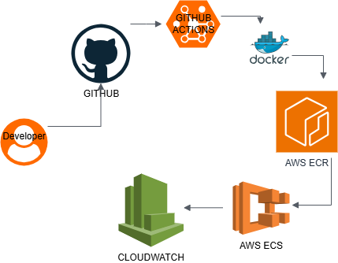

# DevOps AWS ECS Deployment Project

## Architecture Diagram



# Project Architecture

The deployment workflow follows this structure:

Developer → GitHub → GitHub Actions → Docker Build → AWS ECR → AWS ECS → CloudWatch Logs

Whenever new code is pushed to GitHub, GitHub Actions automatically builds a Docker image, pushes it to AWS ECR, and triggers a new ECS deployment.

AWS ECS then pulls the latest Docker image from ECR and runs the application container.

CloudWatch is used to collect logs and monitor the running container.

---

## Project Overview

This project demonstrates a complete DevOps workflow for deploying a containerized Node.js application to AWS using modern cloud and automation tools.

The application was built with Node.js, containerized using Docker, deployed on AWS ECS, provisioned with Terraform, and automated using GitHub Actions CI/CD.

Although the application itself is intentionally simple, the main goal of the project was to demonstrate practical DevOps engineering skills such as:

- Containerization
- Cloud deployment
- Infrastructure as Code (IaC)
- CI/CD automation
- Monitoring and logging
- Version control and deployment workflows

---

# Technologies Used

- Node.js
- Docker
- AWS ECS (Fargate)
- AWS ECR
- Terraform
- GitHub Actions
- AWS CloudWatch
- Git
- GitHub

---


# Why These Technologies Were Used

## Docker

Docker was used to package the application into a container.

This ensures the application runs consistently across different environments without dependency or configuration issues.

Instead of relying on local machine configurations, the entire runtime environment is packaged into the container.

---

## AWS ECS

AWS ECS was used to run and manage the Docker container.

ECS was selected because it integrates well with Docker and simplifies container deployment compared to manually managing EC2 servers.

Using ECS also aligns better with modern cloud-native deployment practices.

---

## Terraform

Terraform was used to provision AWS infrastructure using Infrastructure as Code.

Instead of manually creating cloud resources through the AWS Console, infrastructure can be defined in code and recreated consistently.

This improves automation, repeatability, and infrastructure management.

---

## GitHub Actions

GitHub Actions was used to automate the CI/CD workflow.

Once code is pushed to GitHub, the deployment pipeline automatically:

1. Builds the Docker image
2. Authenticates with AWS
3. Pushes the image to ECR
4. Triggers ECS redeployment

This removes the need for manual deployment steps.

---

## CloudWatch

CloudWatch was used for monitoring and logging.

Container logs are collected automatically, making it easier to monitor application behavior and troubleshoot issues.

---

# Infrastructure Components

The following AWS resources were created during the project:

- ECS Cluster
- ECS Service
- ECS Task Definition
- ECR Repository
- IAM Roles
- CloudWatch Log Groups
- Networking Components

---

# CI/CD Workflow

The CI/CD pipeline performs the following steps automatically:

1. Detects new code pushed to GitHub
2. Builds a Docker image
3. Logs into AWS ECR
4. Pushes the Docker image to ECR
5. Triggers ECS to redeploy the updated container

This allows deployments to happen automatically whenever changes are pushed to the repository.

---

# Local Development Setup

## Install Dependencies

```bash
npm install
```

## Run Application

```bash
npm start
```

Application runs on:

```text
http://localhost:3000
```

---

# Docker Commands

## Build Docker Image

```bash
docker build -t devops-app .
```

## Run Docker Container

```bash
docker run -p 3000:3000 devops-app
```

---

# Terraform Commands

## Initialize Terraform

```bash
terraform init
```

## Preview Infrastructure

```bash
terraform plan
```

## Deploy Infrastructure

```bash
terraform apply
```

---

# GitHub Actions Workflow

The GitHub Actions workflow file is located at:

```text
.github/workflows/deploy.yml
```

The workflow automates:

- Docker image build
- AWS authentication
- ECR image push
- ECS deployment update

---

# Monitoring and Logging

AWS CloudWatch was configured to collect logs from the ECS container.

This helps with:

- Monitoring application activity
- Debugging deployment issues
- Viewing runtime logs
- Tracking container behavior

---

# Challenges Encountered

Some challenges encountered during the project included:

- AWS ECR authentication issues
- ECS task configuration setup
- Docker image tagging errors
- Terraform configuration troubleshooting
- GitHub Actions AWS permission configuration

These issues were resolved through debugging, proper AWS configuration, and deployment testing.

---

# Future Improvements

Possible future improvements include:

- Application Load Balancer setup
- HTTPS/SSL configuration
- Custom domain integration
- Auto scaling
- Blue/Green deployments
- Kubernetes migration using EKS
- Multi-environment deployments
- Secrets management with AWS Secrets Manager

---

# Key DevOps Concepts Demonstrated

This project demonstrates several important DevOps concepts including:

- Infrastructure as Code
- Containerization
- Continuous Integration
- Continuous Deployment
- Cloud-native deployment
- Automation workflows
- Monitoring and logging
- Version-controlled infrastructure

---

# Conclusion

This project demonstrates a complete modern DevOps deployment workflow using Docker, Terraform, AWS ECS, and GitHub Actions.

The goal of the project was not just to deploy an application, but also to implement automation, cloud infrastructure provisioning, container orchestration, and monitoring practices commonly used in real-world DevOps environments.
